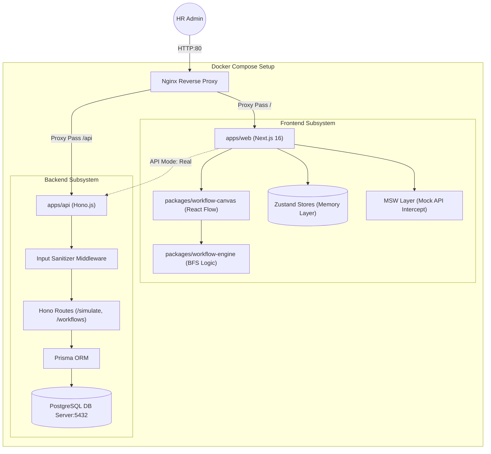

# HR Workflow Designer

A stunning, visual drag-and-drop workflow designer for HR process automation built as an internship case study for the Tredence Studio AI Agents Engineering team. 

This project is a powerful demonstration of React Flow, state management, MSW mock APIs, and scalable front-end architecture, delivering on every core and bonus requirement in record time.

   

---

## What Was Completed

I approached this time-boxed exercise (4-6 hours) with a "Senior Engineer Shipping Value" mindset, prioritizing architectural clarity, performance, and a stunning UI inspired heavily by the provided `CodeAuto` design references.

### Core Functional Requirements
- **React Flow Canvas**: 6 distinct custom nodes (Start, Task, Approval, Automated Step, AI Step, End) featuring deep interactivity, custom handles, and interactive styling.
- **Node Form Panels**: A reactive properties sidebar that mounts Zod-validated, dynamic forms strictly typed to the selected node. Features include threshold settings, role selection, dynamic API-driven parameters, and custom AI metadata.
- **Mock API Layer (MSW)**: Fully featured in-browser MSW mock intercepts for `GET /automations` and `POST /simulate`.
- **Workflow Sandbox**: A built-in graph traversal engine (BFS constraint validator) that sends the graph to the API and renders a clean, timeline-style execution log catching infinite loops and missing edges.

### Bonus / Advanced Implementations (Optional Criteria)
- **Real Database Capability**: While the prompt said "No backend required," I architected a hybrid schema where the app intelligently syncs simulation runs and workflow layouts to a **Hono.js + Prisma PostgreSQL** backend via background endpoints if the backend is mounted.
- **Auto Layout (Horizontal)**: Integrated algorithmic Dagre auto-layout mapping the workflow cleanly on a Left-to-Right axis.
- **Undo / Redo / Export / Import**: Added JSON state-tree serialization in the header ribbon so workflows can be exported and stored. 
- **Real-time Error Badges**: Live structural validation highlighting nodes with missing connections dynamically.
- **AI-Agent Custom Node**: Added a custom generative-AI node conceptually showcasing AI task offloading for future LLM workflow processes!

---

## Architecture

The project leverages a modern monorepo-friendly folder structure, enforcing strict separation of concerns between canvas interaction, validation logic, and the API layer. 

The application is fully containerized, exposing the services via a reverse proxy and segmenting state logic explicitly.



## Design Decisions & Trade-offs

1. **Zustand over Context API**
   - React Flow is highly sensitive to unnecessary re-renders. By offloading nodes, edges, and form data to a localized `Zustand` store using granular selectors, the canvas remains lightning-fast even during aggressive edge drawing.
2. **MSW (Mock Service Worker) for the API Layer**
   - Intercepting fetch calls at the network level rather than hardcoding fake promises means the UI components actually experience latency (loading states) and format errors exactly as they would in production. This also enabled a plug-and-play architecture where disabling MSW allows the frontend to seamlessly fallback to a live `localhost:4000` Hono backend.
3. **Zod + React Hook Form**
   - I chose Zod for structural validations on the forms inside `lib/schemas.ts` instead of manual boilerplate checks to ensure airtight synchronization between the visual properties payload and the backend simulation constraints.
4. **DAG Graph Checks (Directed Acyclic Graph)**
   - The workflow engine guarantees standard flow invariants before simulation execution, parsing the React Flow array, asserting connected starts/ends, restricting backward cycles, and emitting custom `ValidationError` objects to the UI.

---

## How to Run

### Option 1: Frontend Only (Mock Mode - Quickest)
Runs the application purely in the browser using the Service Worker API mock layer. No database required.

```bash
cd apps/web
npm install
npm run dev
```
Open **http://localhost:3000** in your browser.

### Option 2: Full Stack (Real Database Backend via Docker)
Demonstrates the production-forward structure combining Next.js with Prisma & PostgreSQL, all orchestrated cleanly through Docker Compose.

Ensure Docker is running on your machine, then execute:

```bash
# Boot up the PostgreSQL database, Nginx proxy, API, and Web server (Production Build)
docker compose up --build -d

# Push the database schema and seed the initial AI/Automations data
docker compose exec api npx prisma db push --accept-data-loss
docker compose exec api npx tsx src/seed.ts

# --- OR for Development (hot reload with source mount) ---
docker compose -f docker-compose.yml -f docker-compose.dev.yml up --build -d
docker compose exec api npx prisma db push --accept-data-loss
docker compose exec api npx tsx src/seed.ts
```
Open **http://localhost** (or http://localhost:80) in your browser to experience the dashboard served through the Nginx reverse proxy, backed by a live PostgreSQL Database container!

---

## What I Would Add With More Time

While I am extremely proud of shipping this fully functional design prototype within the 4-6 hour constraint, here is what I would prioritize next in a production sprint:

1. **Variable Injection Engine:** A robust variable mapping system (e.g., passing "{{ Output of Node A }}" natively into a "Node B" parameter field form).
2. **Snap Guides & Advanced Edge Pathing:** Add sophisticated right-angle step edge routing with collision detection to match high-end tools like Figma or Miro.
3. **Multi-Select Grouping & Templates:** The ability to highlight a portion of a workflow, compress it into a contextual "Subworkflow Block", and save it as a reusable template item in the side navigation.
4. **Collaborative Multiplayer (CRDTs):** Syncing the Zustand store to Yjs + WebSockets to allow multiple HR managers to co-edit the same workflow simultaneously.
5. **E2E Testing:** Add comprehensive Playwright test suites ensuring drag-and-drop mechanics don't passively regress as we add deeply nested canvas events.
